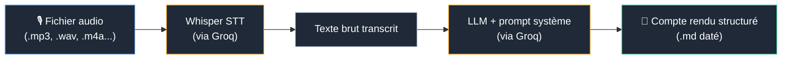

#  Scribe

> Transforme un enregistrement audio en compte rendu structuré — en une seule commande.

Scribe prend un fichier audio (réunion, cours, note vocale), le transcrit avec un modèle Speech-to-Text, puis reformule cette transcription brute en compte rendu propre (titre, résumé, points clés, décisions/actions) grâce à un LLM. Les deux modèles sont appelés via l'API serverless de [Groq](https://groq.com).


---

## Sommaire

- [Fonctionnalités](#-fonctionnalités)
- [Architecture](#-architecture)
- [Installation](#-installation)
- [Configuration](#-configuration)
- [Utilisation](#-utilisation)
- [Structure du projet](#-structure-du-projet)
- [Questions de réflexion du TP](#-questions-de-réflexion-du-tp)
- [Tests](#-tests)
- [Workflow Git & contribution](#-workflow-git--contribution)

---

##  Fonctionnalités

-  **Transcription audio** (Speech-to-Text) via Whisper, servi par Groq
-  **Génération de compte rendu structuré** via un LLM, avec un prompt système dédié
-  **Interface en ligne de commande** : un fichier audio en entrée, un compte rendu en sortie
-  **Sauvegarde automatique** du compte rendu en Markdown, horodaté
-  **Clé API protégée** : jamais écrite en dur, jamais commitée (chargée depuis `.env`)
-  **Gestion d'erreurs explicite** : fichier introuvable, erreurs réseau/API

---

##  Architecture



Le programme enchaîne deux appels à l'API Groq : un premier vers l'endpoint `/audio/transcriptions` (Whisper), un second vers `/chat/completions` (LLM), avec un prompt système qui impose la structure du compte rendu.

---

## Installation

```bash
git clone https://github.com/linabnz/Scribe.git
cd Scribe

python -m venv venv
source venv/bin/activate        # Linux/Mac
# venv\Scripts\Activate.ps1     # Windows PowerShell

pip install -r requirements.txt
```

---

##  Configuration

Scribe a besoin d'une clé API Groq, gratuite sur [console.groq.com/keys](https://console.groq.com/keys).

```bash
cp .env.example .env
```

Édite `.env` et renseigne ta clé :

```
GROQ_API_KEY=ta_cle_ici
```

---

##  Utilisation

```bash
python src/cli.py audio_samples/reunion.mp3
```

Exemple de déroulement :

```
Transcription en cours (audio_samples/reunion.mp3)...
Transcription terminée.
Rédaction du compte rendu en cours...
Compte rendu généré.

# Compte rendu — Réunion d'équipe du 6 juillet

## Résumé
Réunion portant sur la validation du budget et le planning de lancement du projet.

## Points clés
- Budget validé à 15 000 €
- Lancement reporté à septembre

## Décisions / Actions
- Julie : envoyer le rapport technique avant vendredi
- Marc : contacter le fournisseur cette semaine

Compte rendu sauvegardé dans : comptes_rendus/compte_rendu_2026-07-06_143000.md
```

Le compte rendu est à la fois affiché à l'écran et sauvegardé dans `comptes_rendus/`, avec un nom de fichier horodaté (`compte_rendu_AAAA-MM-JJ_HHMMSS.md`) pour ne jamais écraser les précédents.

---

##  Structure du projet

```
Scribe/
├── audio_samples/          # exemples audio légers pour les tests manuels
├── comptes_rendus/         # comptes rendus générés à l'exécution (ignoré par git)
├── src/
│   ├── config.py           # clé API + noms des modèles (seul endroit du projet)
│   ├── transcriber.py      # transcription audio (Speech-to-Text)
│   ├── summary.py          # génération du compte rendu (LLM)
│   ├── cli.py               # point d'entrée en ligne de commande
│   └── prompts/
│       └── system_prompt.txt   # instructions de structuration du compte rendu
├── .env.example             # variables attendues, sans valeur
├── .gitignore
├── requirements.txt
└── README.md
```

---

##  Questions de réflexion du TP

### Q1 — Pourquoi le `.gitignore` doit-il exister avant d'écrire la moindre ligne de code manipulant des secrets ?

Parce que Git ne fait pas de distinction entre un fichier "sensible" et un fichier normal : dès qu'un fichier existe dans le dossier et qu'on tape `git add .`, il est suivi. Si le `.gitignore` n'exclut pas encore `.env` au moment où on écrit le premier bout de code qui le lit, il suffit d'un `git add .` un peu trop rapide pour que la clé API se retrouve commitée. Et un commit, une fois poussé, **ne s'efface pas simplement en supprimant le fichier au commit suivant**

Écrire le `.gitignore` en premier, c'est se mettre à l'abri de l'erreur avant qu'elle ne soit possible.

### Q2 — Quels modèles STT et LLM propose Groq aujourd'hui, et lesquels choisissez-vous ?

| Usage | Modèle choisi | Vitesse | Coût |
|---|---|---|---|
| Speech-to-Text | `whisper-large-v3` | ~216x temps réel | $0.111 / heure d'audio |
| Génération du compte rendu | `llama-3.3-70b-versatile` | ~280-390 tokens/s | $0.59 / $0.79 par 1M tokens (entrée/sortie) |

**Côté STT**, Groq propose deux variantes de Whisper : `whisper-large-v3` et `whisper-large-v3-turbo` (moins cher, $0.04/h, plus rapide, ~228x temps réel, mais légèrement moins précis). On choisit la version standard `whisper-large-v3` : Scribe traite des enregistrements de réunion (accents, bruit de fond, plusieurs locuteurs qui se coupent la parole), et la fiabilité de la transcription compte plus que les quelques secondes gagnées par la version turbo sur un usage qui n'est de toute façon pas temps réel.

**Côté LLM**, Groq héberge plusieurs familles de modèles (Llama, GPT-OSS, Qwen...). On choisit `llama-3.3-70b-versatile` plutôt qu'un modèle plus léger comme `llama-3.1-8b-instant` : la tâche demandée : extraire fidèlement décisions et actions d'une transcription sans en inventer, demande une meilleure capacité de suivi d'instructions strictes qu'un modèle 8B, et le surcoût reste marginal à l'échelle d'un usage personnel ou de petite équipe.

### Q3  Que renvoie exactement l'API en plus du texte ?

Au-delà du texte transcrit, l'API Speech-to-Text de Groq (en `response_format="verbose_json"`) renvoie :
- la **langue détectée**
- la **durée** totale de l'audio
- des **segments horodatés** (début/fin de chaque portion de discours), chacun accompagné de :
  - `avg_logprob` : indicateur de confiance du modèle sur ce segment
  - `no_speech_prob` : probabilité que le segment soit un silence
  - `compression_ratio` : utile pour repérer des répétitions ou du bégaiement


### Q4 — Quelle température choisissez-vous pour cet usage, et pourquoi ?

Scribe utilise `temperature=0.2`. La température contrôle le degré d'aléatoire du LLM : proche de 0, le modèle privilégie systématiquement les mots les plus probables (sorties très reproductibles) ; proche de 1, il explore des formulations plus variées, au prix d'une certaine imprévisibilité.

### Q5 — Votre prompt système est envoyé à chaque requête : quel lien avec la notion de tokens en cache vue en cours ?

Le `system_prompt.txt` de Scribe est **identique à chaque appel** à `generate_summary()` : seul le texte de la transcription change d'une requête à l'autre. Ce préfixe fixe et répété est exactement le cas d'usage du **prompt caching** vu en cours : plusieurs fournisseurs compatibles OpenAI (dont Groq) mettent en cache les tokens d'entrée identiques d'une requête à l'autre, et facturent les tokens en cache à un tarif réduit (jusqu'à -50 % sur les tokens en cache chez Groq) plutôt qu'au tarif plein.

---

##  Tests

```bash
pip install -r requirements-dev.txt
pytest -v
```

Les tests unitaires utilisent un client Groq mocké : aucun appel réseau réel, aucune consommation de quota.

---

##  Workflow Git & contribution

Ce projet suit un modèle **GitFlow simplifié** :

- `main` : version stable, taguée à chaque jalon (`v0.1.0`, ...)
- `dev` : branche d'intégration, cible de toutes les pull requests de fonctionnalité
- `feature/nom-parlant` : une branche par fonctionnalité, créée depuis `dev`

**Rituel pour chaque fonctionnalité** :
1. `git switch dev && git pull`
2. `git switch -c feature/nom-parlant`
3. Commits atomiques, message clair (`feat: ...`, `fix: ...`, `docs: ...`)
4. `git push -u origin feature/nom-parlant`
5. Pull request vers `dev`, relue et approuvée par le binôme
6. Merge, suppression de la branche, retour à l'étape 1

---

*Projet réalisé dans le cadre du TP « Scribe : Git, GitHub »  Master 2 MD5, 2026.*